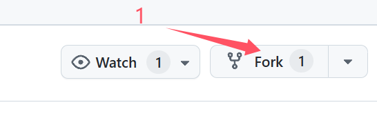
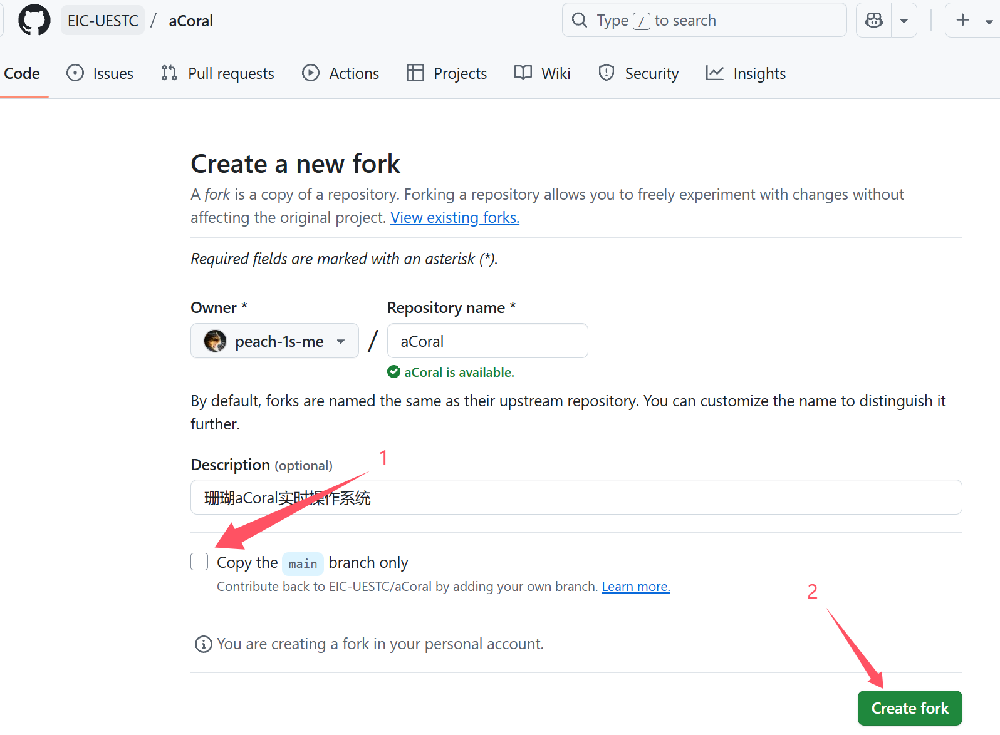
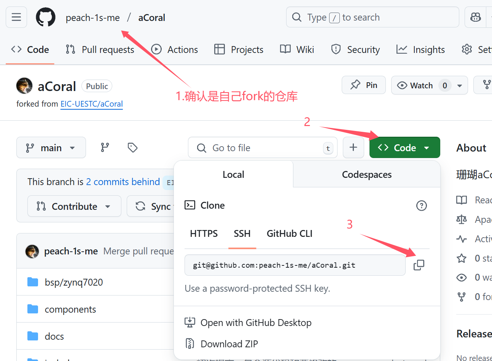
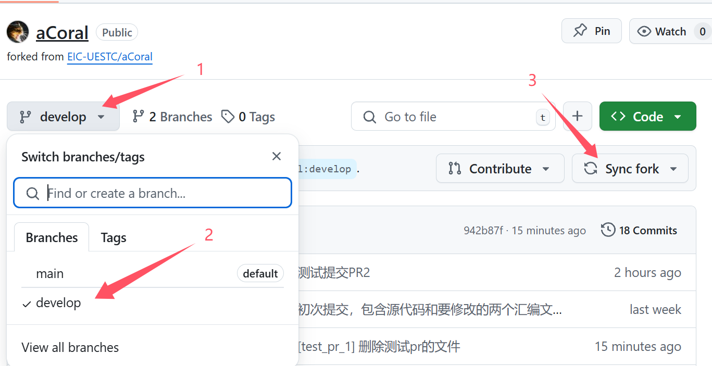
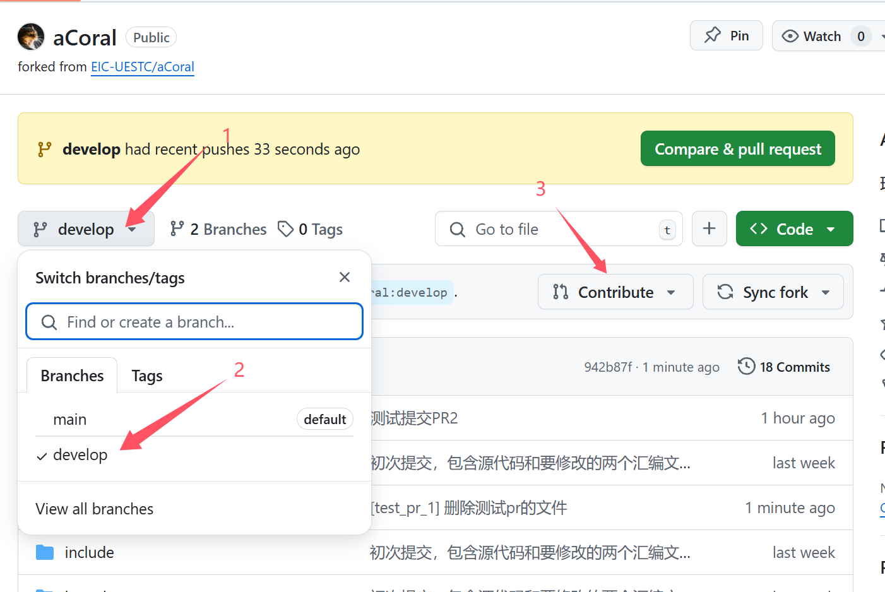
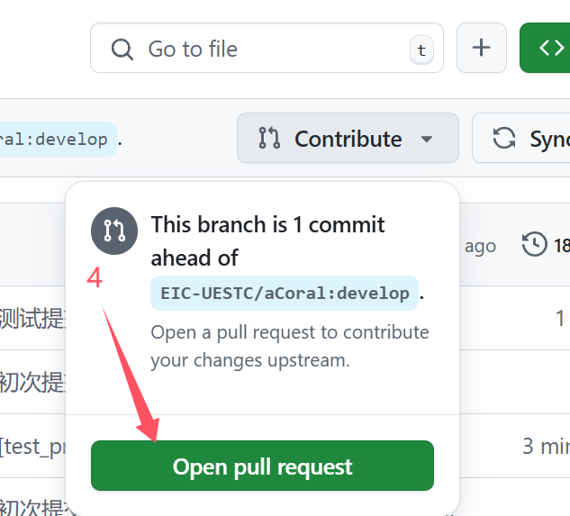
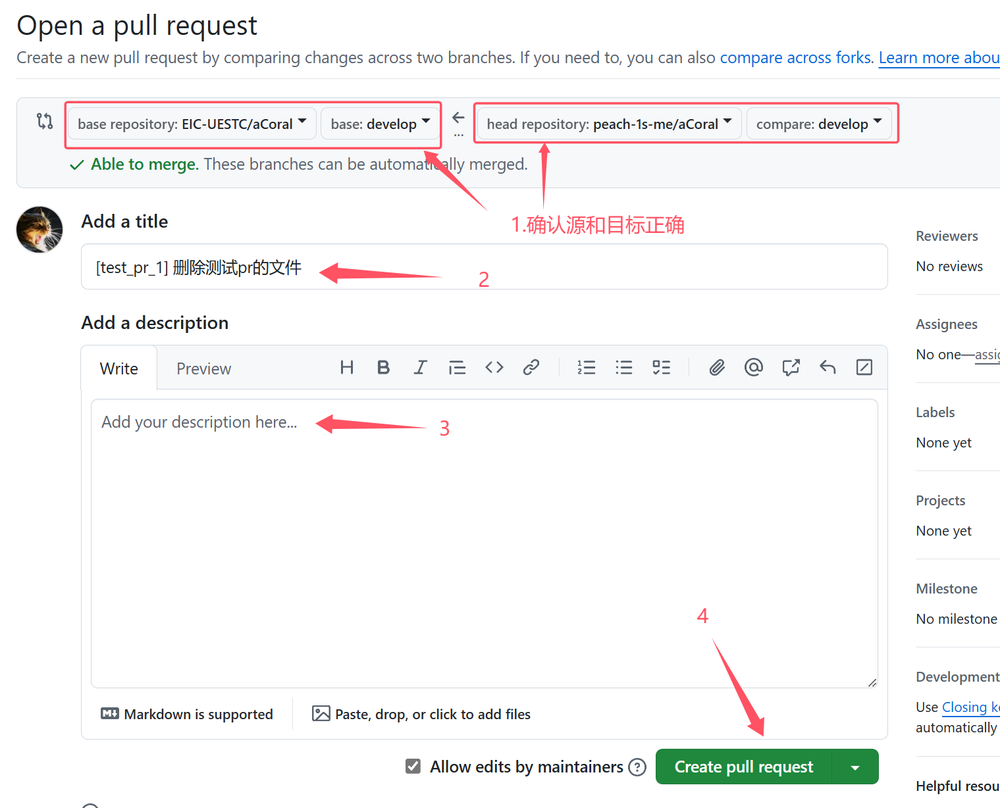

# aCoral 代码提交流程

## 1.fork仓库
fork aCoral到自己的仓库, 后文将以 fork-aCoral 称呼自己账号下的 aCoral


确认fork信息, 注意取消勾选"仅复制主分支", 因为我们的代码主要基于 develop 分支进行修改和提交


## 2.克隆到本地
不一定要用 ssh, 但是这个比较方便


```
git clone git@github.com:[你的githubID]/aCoral.git
```

进入仓库目录
```
cd aCoral
```

切换到 develop 分支
使用 GitBash 或其他可以使用 git 的终端打开克隆到本地的 fork-aCoral 目录

使用 `git branch
-a` 可以查看分支
切换到 develop 分支
```
git checkout develop
```

## 3.修改代码


此时修改的代码在本地的 develop 下生效

## 4.提交到本地

1) 将代码修改加入暂存区
```
git add .
```

2) 提交修改到本地
```
git commit -m "[TAG] 1.修改内容1; 2.修改内容2;..."
```
其中 TAG 是提交标签, 表明提交的内容类型:
```
feat     新功能或特性
fix      修复bug
docs     文档更新
style    代码格式调整
refactor 重构代码
test     新增或更新测试
```

推送到远程 fork-aCoral 仓库

push前注意更新一下 fork-aCoral, 此时主 aCoral 仓库如果有更新, 可能和本地代码有冲突


然后拉取一下代码:
```
git pull --rebase
```
== 必须加 --rebase 忘加了就想办法回退 ==

最后再push
```
git push
```

## 5.提交 Pull Request

在 github 自己的 fork-aCoral 下提交PR




注意提交到 develop 分支, 填写 PR 的介绍啥的即可




